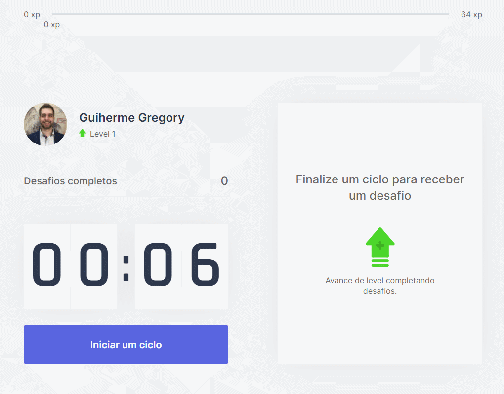

<h1 align="center">
  Move.it 
   
</h1>

    Projeto desenvolvido durante a 4º Edição do Evento Next Level Week (Trilha React JS), da Rocketseat, com o Instrutor <a href="https://github.com/diego3g">Diego Fernandes</a>. 🚀

    
    

    

    <a href="#-o-projeto">O Projeto</a> •
    <a href="#-tecnologias">Tecnologias</a> •
    <a href="#-como-usar">Como Usar</a> •
    <a href="#-licença">Licença</a>

<h2>🚀 O Projeto</h2>

    O projeto Move.it tem o objetivo de te ajudar a realizar mais exercícios corporais e oculares durante o trabalho, a fim de evitar dores e problemas devido ao trabalho direto sem exercícios.

    O Move.it tem um cronômetro, em que você inicia um ciclo, e quando tempo finaliza você recebe desafios para realizar diferentes tipos de exercícios corporais e oculares, e ai você indica se você completou ou falhou no desafio, e pode iniciar um novo ciclo.

    Quando você completa um desafio, você ganha uma determinada quantidade de xp, e pode ir subindo de nível a cada quantidade.
    Aproveite para se divertir enquanto cuida da sua saúde.

<h2>🔨 Tecnologias</h2>

O projeto foi desenvolvido utilizando as seguintes tecnologias:

<ul>
    <li>
        <a href="https://pt-br.reactjs.org/">React JS</a>
    </li>
    <li>
        <a href="https://nextjs.org/">Next JS</a>
    </li>
    <li>
        <a href="https://www.typescriptlang.org/">Typescript</a>
    </li>
</ul>

<h2>🔧 Como Usar</h2>

<h3>Pré-Requisitos</h3>

Antes de começar, você vai precisar ter instalado em sua máquina as seguintes ferramentas:

<ul>
    <li>
        <a href="https://git-scm.com">GIT</a>
    </li>
    <li>
        <a href="https://nodejs.org/en/">Node.js</a>
    </li>
    <li>
        <a href="https://code.visualstudio.com/">VSCode</a>
    </li>
</ul>

Caso não queira o npm como o seu gerenciador de pacotes, pode utilizar também o:

<ul>
    <li>
        <a href="https://yarnpkg.com/">Yarn</a>
    </li>
</ul>

<h3>Iniciando o App</h3>

<pre># Clone este repositório
<code>$ git clone https://github.com/guilhermegregory/rocketseat-nlw04-reactjs-nextjs-moveit</code>

# Acesse a pasta do projeto pelo terminal
<code>$ rocketseat-nlw04-reactjs-nextjs-moveit</code>

# Instale as dependências com yarn
<code>$ yarn add</code>

# Ou, se preferir, instale as dependências com npm
<code>$ npm install</code>

# Inicie o app com yarn
<code>$ yarn dev</code>

# Ou, se preferir, inicie o app com npm
<code>$ npm run dev</code>

# Acesse, em seu navegador, o endereço: http://localhost:3000</pre>

<h2>📄 Licença</h2>

    Este projeto está sob a licença MIT. Para mais detalhes, veja o arquivo <a href="LICENSE.md">LICENSE</a>.

---

<h4 align="center">
    Feito com 💙 by <a href="https://www.linkedin.com/in/guilherme-gregory-3873b1171/">Guilherme Gregory</a>.
</h4>